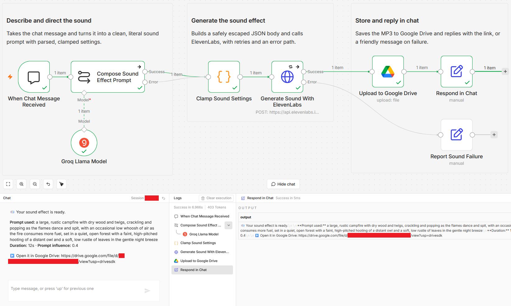
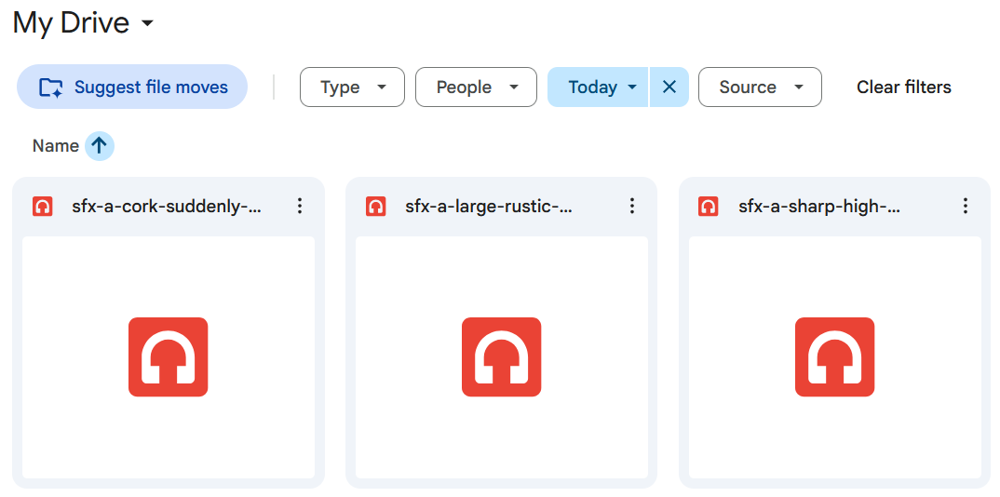

# Generate sound effects from chat using ElevenLabs and Google Drive

[Published n8n template](https://n8n.io/workflows/16881-generate-sound-effects-from-chat-with-groq-elevenlabs-and-google-drive/)

Type a plain description of a sound into an n8n chat and get back a ready to use MP3, saved to Google Drive with the shareable link posted in the reply. A Groq model sits in the middle as a sound-effects director: it rewrites casual words like "a heavy wooden door creaking open" into the literal, detailed prompt the ElevenLabs sound-generation API responds to best, and picks a duration and prompt influence to match.

Built with n8n, plus Groq, ElevenLabs, and Google Drive.

## Use it when

- You are cutting a video and need one foley clip, a door creak or a rain loop, without leaving your desk to dig through a sound library.
- A game jam or prototype needs placeholder effects now. Polished ones can come later, but silence blocks the playtest.
- You want ElevenLabs sound generation without learning its prompt style. The director does the phrasing for you.

## How it works

You send one message. The director turns it into a precise ElevenLabs prompt plus a small JSON object with a duration and a prompt influence, then the workflow generates the clip, stores it, and sends the link back.

| Stage | What happens |
|---|---|
| When Chat Message Received | You type a plain description of a sound |
| Compose Sound Effect Prompt | A Groq model (`llama-3.3-70b-versatile` on a Basic LLM Chain) rewrites it into a literal ElevenLabs prompt and returns JSON with the prompt, a duration, and a prompt influence |
| Clamp Sound Settings | A Code node parses that JSON, clamps duration to 0.5 to 30 seconds and prompt influence to 0 to 1, and falls back to your raw words if the reply is unclear |
| Generate Sound With ElevenLabs | An HTTP request calls the sound-generation endpoint and gets back an MP3, retrying three times before taking the error path |
| Upload to Google Drive | Saves the clip, named from the prompt and a timestamp |
| Respond in Chat | Posts the Drive link, the exact prompt used, and the duration |
| Report Sound Failure | Sends a friendly chat message when generation fails after the retries |

I put the director between you and the API because ElevenLabs gives noticeably better effects from literal, descriptive prompts than from the casual words people actually type.

## Requirements

- An ElevenLabs API key. Sound generation is a paid feature of your ElevenLabs plan, billed at around 40 credits per second of audio.
- A Groq API credential for the director model.
- A Google account with a Drive folder for the clips.
- n8n (cloud or self-hosted) with Groq and Google Drive OAuth2 credentials, plus a Header Auth credential for ElevenLabs.

## Setup

1. Import `workflow.json` into n8n. It imports inactive; configure before using it.
2. Create a Header Auth credential named `ElevenLabs` with header name `xi-api-key` and your ElevenLabs API key, and select it on "Generate Sound With ElevenLabs".
3. Select your Groq credential on "Groq Llama Model". The model is `llama-3.3-70b-versatile`.
4. Connect your Google Drive account on "Upload to Google Drive" and set the parent folder that should hold the clips. It ships pointing at your Drive root, so set a folder before the clips pile up there.
5. Open the chat with the chat button on the canvas and describe a sound.

## The sound director

The director prompt lives in "Compose Sound Effect Prompt" and returns three fields:

| Field | What it controls |
|---|---|
| `sfx_prompt` | The literal, detailed sound description sent to ElevenLabs |
| `duration_seconds` | Clip length, 0.5 to 30. Short impacts stay short, ambiences run longer |
| `prompt_influence` | 0 to 1. Around 0.3 for natural sounds, higher for precise or mechanical ones |

The model is asked to return only JSON. If the reply is ever malformed or empty, the Code node falls back to your own words, so a bad value never reaches the API and every message still makes a sound. To change the style, edit the guidance in that node's prompt.

One sound is generated per message, and the clamped duration is also the cost control at around 40 credits per second.

## The clips in Drive

Each message drops a ready MP3 into your Drive folder, named from the prompt and a timestamp.

## Customize

- Swap the chat trigger for a form or webhook to fit the generator into another surface.
- Edit the guidance in "Compose Sound Effect Prompt" to change the sound style or the duration and prompt-influence choices.
- Point "Upload to Google Drive" at a different folder, or rewrite the clip-naming expression on that node.
- Swap the model on "Groq Llama Model" for any other chat model your instance has credentials for.

## What is in this folder

| File | What it is |
|---|---|
| `README.md` | This overview |
| `TEMPLATE-DESCRIPTION.md` | The n8n Creator hub listing text |
| `workflow.json` | The importable n8n workflow |
| `images/workflow.png` | The workflow on the n8n canvas |
| `images/clips-in-drive.png` | Generated clips in the Drive folder |

---

All sample data is fictional. No real credentials, IDs, or endpoints are included.

Part of the [n8n-exekyute-templates](../../README.md) collection. MIT licensed.
