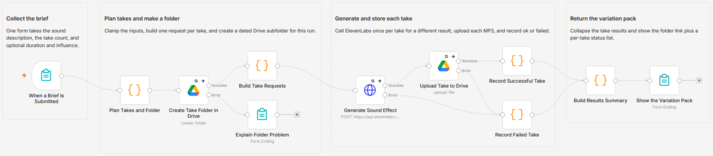

# Generate a sound effect variation pack from one brief using ElevenLabs and Google Drive

[Published n8n template](https://n8n.io/workflows/16954-generate-sound-effect-variation-packs-with-elevenlabs-and-google-drive/)

Submit one sound brief through a form and get several ElevenLabs takes of it back, each saved into a dated Google Drive folder as take-1.mp3 through take-N.mp3. The sound-generation API has no seed, so re-running the same brief is exactly how you get real variety, and this workflow does that fan-out for you.

Built with n8n, plus ElevenLabs and Google Drive.

## Use it when

- You need options for one cue, not a single one-shot result you either keep or regenerate by hand. One form submission returns a small pack to audition.
- You keep re-running the same prompt manually and losing track of which download was which. Every take here lands in one dated folder with a numbered filename.
- You are placing a sound in a video, game, or app and want three or four candidates side by side before committing.

## How it works

A form takes the brief, a Code node clamps the inputs and plans the run, and a dated subfolder is created in Drive. The brief then fans out into one ElevenLabs call per take, each MP3 is uploaded, and the form's final page shows the folder link with a per-take result list.

| Stage | What happens |
|---|---|
| When a Brief Is Submitted | Takes the sound description, a take count from 1 to 5, and optional duration and prompt influence |
| Plan Takes and Folder | Clamps the inputs, names a run folder from the brief plus a timestamp, and plans one take per request |
| Create Take Folder in Drive | Creates that subfolder under your configured parent folder |
| Build Take Requests | Turns the plan into one ElevenLabs request body per take |
| Generate Sound Effect | POSTs each request to the sound-generation endpoint; with no seed, each call comes back different |
| Upload Take to Drive | Saves each returned MP3 into the subfolder as take-1.mp3 through take-N.mp3 |
| Record Successful Take / Record Failed Take | Marks each take's outcome so a failed generation or upload is listed, not hidden |
| Build Results Summary / Show the Variation Pack | Returns the folder link plus the per-take list on the form's completion page |
| Explain Folder Problem | Returns a plain setup message when the folder ID or Drive credential is missing, instead of a generic error |

I nudge prompt influence up slightly on each take as a second variety lever, because the brief itself stays identical on every call.

## Requirements

- An ElevenLabs account and API key. Each take is one sound-generation call, so a pack of N takes costs N generations against your plan.
- A Google account with a Drive folder to hold the packs.
- n8n (cloud or self-hosted) with an ElevenLabs Header Auth credential and a Google Drive OAuth2 credential that can write to that folder.

## Setup

1. Import `workflow.json` into n8n. It imports inactive; configure before activating.
2. Create an ElevenLabs credential as Header Auth: header name `xi-api-key`, value your ElevenLabs API key. Name it `ElevenLabs` and assign it to "Generate Sound Effect".
3. Create a Google Drive OAuth2 credential and assign it to both Drive nodes.
4. Open "Plan Takes and Folder" and set `PARENT_FOLDER_ID` to the Drive folder that should hold the generated packs.
5. Run it once from the form on a short brief, then activate.

## Takes and variety

| Input | Range | Default |
|---|---|---|
| Number of takes | 1 to 5 | 3 |
| Duration | 0.5 to 30 seconds | Blank, which lets ElevenLabs choose a natural length |
| Prompt influence | 0 to 1 | 0.3, nudged up by 0.1 per take |

A take that fails to generate or upload is recorded as failed and still listed, so a partial pack never looks like a total success. The Drive and ElevenLabs calls each retry up to 3 times before a take counts as failed. Takes are saved as MP3 at 44.1 kHz, 128 kbps.

## Customize

- Change the per-take prompt-influence step (`INFLUENCE_STEP`, 0.1) or any of the clamps in the "Plan Takes and Folder" Code node.
- Rename the run folders in the same node: the pattern is the brief slugged to 40 characters plus a timestamp.
- Change the audio format through the `output_format` query parameter on "Generate Sound Effect", which ships as `mp3_44100_128`.
- Rename the files on "Upload Take to Drive", where the take-N.mp3 pattern lives.
- Add fields to the form, then carry them into the request body in "Build Take Requests".

## What is in this folder

| File | What it is |
|---|---|
| `README.md` | This overview |
| `TEMPLATE-DESCRIPTION.md` | The n8n Creator hub listing text |
| `workflow.json` | The importable n8n workflow |
| `images/workflow.png` | The workflow on the n8n canvas |

---

All sample data is fictional. No real credentials, IDs, or endpoints are included.

Part of the [n8n-exekyute-templates](../../README.md) collection. MIT licensed.
