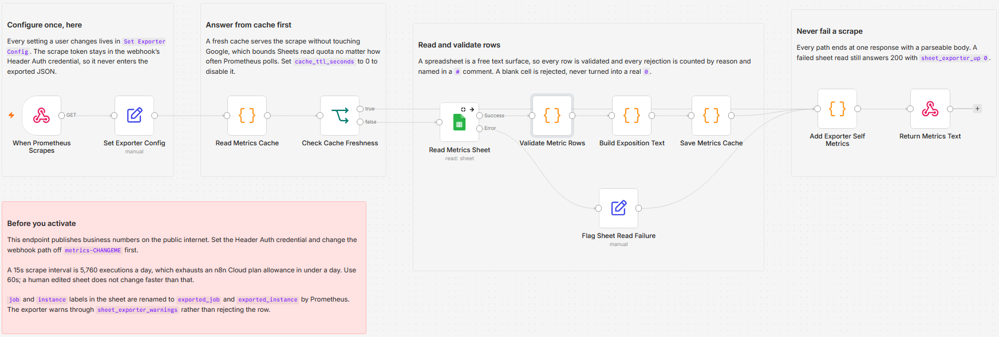

# Expose Google Sheet KPIs as a Prometheus metrics endpoint for Grafana

[Published n8n template](https://n8n.io/workflows/17546-expose-google-sheet-kpis-as-prometheus-metrics-for-grafana/)

Serve a tab of business numbers as a Prometheus 0.0.4 text exposition endpoint, so SLO targets, licence counts and hand-counted backlogs land on a Grafana dashboard next to real telemetry. Prometheus scrapes the webhook on its own interval and the workflow answers from a short TTL cache, so a 60 second scrape does not become a Google Sheets read every 60 seconds. A blank cell is rejected and counted, never turned into a real zero.

Built with n8n, plus Google Sheets.

## Use it when

- Your alert rule has `0.995` typed into it, and changing the quarter's SLO target means a pull request against the alerting repo. Put the target in a sheet cell and the next scrape serves the new number as a series the rule can read.
- You have real metrics for seats in use, but the number of seats you actually bought lives in a procurement spreadsheet nobody can expose. Point the exporter at that sheet and seats bought lands on the same graph as seats in use.
- A system on your dashboard has no exporter and no API worth integrating, and somebody already copies its numbers into a sheet every month. That sheet becomes the scrape target, one row per series.

## How it works

Prometheus fetches the webhook. The workflow answers from its own TTL cache when the cached body is younger than `cache_ttl_seconds`, so Google is never touched on a hit. On a miss it reads the sheet, validates every row, renders the survivors into metric families, and caches the result.

| Stage | What happens |
|---|---|
| When Prometheus Scrapes, Set Exporter Config | GET webhook with Header Auth, then every user setting in one node: sheet, cache TTL, series cap, metric prefix |
| Read Metrics Cache, Check Cache Freshness | Reads the cached body and its age from workflow static data, and a fresh cache short-circuits straight to the responder |
| Read Metrics Sheet, Validate Metric Rows | Reads the tab as unformatted values with its error output wired, then rejects and counts every bad row by reason, naming the row number |
| Build Exposition Text, Save Metrics Cache | Renders `# HELP`, `# TYPE` and sorted sample lines with correct escaping, then writes the body back to static data (bodies over 200,000 bytes skip the cache) |
| Flag Sheet Read Failure, Add Exporter Self Metrics, Return Metrics Text | Marks a failed read degraded, appends the exporter's own metrics so the body is never empty, and responds as `text/plain; version=0.0.4; charset=utf-8` |

A failed sheet read still answers 200, with `sheet_exporter_up 0` inside the body, the same convention as `mysql_up` and `probe_success`. I ruled out responding 5xx because it tells Prometheus the whole exporter is broken and destroys the meta-metrics that would have explained which part actually failed.

## Requirements

- A Google account with a spreadsheet the workflow can read.
- A Prometheus server or Grafana Agent that can scrape an arbitrary URL with a bearer token.
- n8n (cloud or self-hosted) with a Google Sheets credential and a Header Auth credential.

## Setup

1. Import `workflow.json` into n8n. It imports inactive; configure before activating.
2. Give your sheet the columns `metric_name`, `help`, `type`, `value` and `labels`, one row per series.
3. Add a Google Sheets credential to "Read Metrics Sheet", then open "Set Exporter Config" and fill in `sheet_id` and `sheet_tab`.
4. Create a Header Auth credential on the webhook with header name `Authorization` and value `Bearer YOUR_TOKEN`, and change the path off `metrics-CHANGEME`.
5. Activate and curl the production URL to confirm the body parses, then add the scrape job to `prometheus.yml`, pointing `metrics_path` at the webhook path with `scrape_interval: 60s`.

## The metrics tab

One row per series. A metric family is every row sharing a `metric_name`.

| Column | What goes in it |
|---|---|
| `metric_name` | The metric, matching `[a-zA-Z_:][a-zA-Z0-9_:]*`. Rows that do not match are rejected. |
| `help` | The `# HELP` text. Resolved from the first non-empty cell in the family, so re-sorting the sheet cannot change it. |
| `type` | `gauge`, `counter` or `untyped`. Blank means gauge. |
| `value` | A number, or `NaN`, `+Inf`, `-Inf`. Blank is rejected, never read as 0. |
| `labels` | `region=us-east,tier=free`. Quote a value to keep a comma inside it: `note="Halifax, NS"`. |

Histogram and summary are rejected on purpose. One row per series cannot express cumulative buckets, `le` labels, `_sum` and `_count`, and declaring the type without emitting those parts gives Grafana functions that can never work.

## Watching the sheet itself

| Metric | What it tells you |
|---|---|
| `sheet_exporter_up` | 1 when the last sheet read succeeded, 0 when it failed |
| `sheet_exporter_series` | How many series this response carried |
| `sheet_exporter_rows_skipped` | Rejected rows, split by reason: `blank_value`, `bad_name`, `duplicate` and six more |
| `sheet_exporter_warnings`, `sheet_exporter_cache_hit` | Non-fatal problems split by rule, and whether this response came from cache |

These families ride every response, cache hit or fresh read, sheet up or down, so a broken spreadsheet is an alertable condition rather than a thing somebody notices weeks later. Alert on `sheet_exporter_up == 0` and on `sheet_exporter_series == 0`. The second one matters more than it looks: a renamed tab returns a valid response with no samples, which Prometheus scores as a perfectly healthy scrape, and every threshold rule built on those series quietly stops evaluating instead of firing. Shortening `cache_ttl_seconds` trades Sheets read quota for freshness, and the exporter never repairs a bad row: it rejects it under one of nine counted reasons and serves the count as data.

## Customize

- **Scrape interval and cache TTL.** 60s is the recommendation, not 15s: a human-edited sheet does not change at 15 second granularity, and 15s is 5,760 executions a day. `cache_ttl_seconds` ships at 30; set it to 0 to disable caching entirely.
- **Metric prefix.** `exporter_prefix` renames every self-metric, and doubles as the blocklist prefix so the sheet cannot shadow them.
- **Failure behaviour.** Set `fail_status_code` to 503 if your deployment prefers a hard failure over the exporter convention, and `serve_stale_on_error` to true to keep serving the last good body through a Sheets outage.

## What is in this folder

| File | What it is |
|---|---|
| `README.md` | This overview |
| `TEMPLATE-DESCRIPTION.md` | The n8n Creator hub listing text |
| `workflow.json` | The importable n8n workflow |
| `images/workflow.png` | The workflow on the n8n canvas |

---

All sample data is fictional. No real credentials, IDs, or endpoints are included.

Part of the [n8n-exekyute-templates](../../README.md) collection. MIT licensed.
