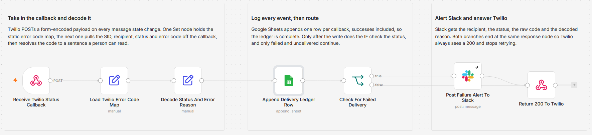

# Log Twilio delivery statuses to Google Sheets and alert Slack on failures

[Published n8n template](https://n8n.io/workflows/17342-log-twilio-sms-delivery-statuses-to-google-sheets-and-alert-slack-on-failures/)

I kept finding out about failed text messages the slow way, by someone telling me they never got one. Twilio already knows, it just posts the answer to a callback URL and moves on. So I pointed that callback at n8n, wrote every event to a sheet, and made the failures shout in Slack with a reason a person can read instead of a five-digit code.

Built with n8n, plus Twilio status callbacks, Google Sheets, and Slack.

## How it works

Twilio POSTs a form-encoded payload to the webhook every time a message changes state, so one message can produce several calls as it moves from queued to sent to delivered. The first Set node holds a static map of Twilio error codes to plain sentences. The second Set node pulls MessageSid, To, MessageStatus, and ErrorCode off the callback, normalizes the status to lowercase, and looks the code up in that map. Google Sheets then appends the whole event as a ledger row, successes included. Only after the row is written does the IF check the status, and only failed and undelivered continue to Slack. Both branches finish at the same Respond to Webhook node, which returns 200 so Twilio stops retrying.

| Stage | What happens |
|---|---|
| Receive Twilio Status Callback | POST webhook that Twilio calls on every message state change |
| Load Twilio Error Code Map | Holds the static code-to-reason map as a single object field |
| Decode Status And Error Reason | Extracts the callback fields and resolves the error code to a sentence |
| Append Delivery Ledger Row | Appends one row per event: timestamp, SID, recipient, status, code, reason |
| Check For Failed Delivery | Passes only `failed` and `undelivered` to the alert branch |
| Post Failure Alert To Slack | Posts the recipient, status, code, decoded reason, and message SID |
| Return 200 To Twilio | Answers the callback on both branches so Twilio does not retry |

Keeping the error map in a Set node means the alert explains the failure without a second API call, and adding a new code is one line of editing rather than another integration.

## Setup

1. Import `workflow.json` into n8n. It imports inactive, so configure it before activating.
2. Add a Google Sheets credential on **Append Delivery Ledger Row** and a Slack credential on **Post Failure Alert To Slack**. No Twilio credential is needed, since Twilio calls in rather than the other way around.
3. Create a sheet with the header row `received_at`, `message_sid`, `to_number`, `message_status`, `error_code`, `failure_reason`, then pick it in the Sheets node and set the tab name. Set the Slack channel you want the alerts in.
4. Activate the workflow, copy the production webhook URL, and set it as the `StatusCallback` on your outbound messages or as the Status Callback URL on your Messaging Service. Send one message and confirm a row lands.

## Testing this on a Twilio trial

You can exercise the whole thing without sending a message or spending trial credit. Turn the workflow on, then POST form-encoded mock callbacks at the webhook URL and watch what happens.

| Test payload | Expected result |
|---|---|
| `MessageStatus=delivered&MessageSid=SM0001&To=%2B15550000001` | One ledger row, empty reason, no Slack post |
| `MessageStatus=failed&MessageSid=SM0002&To=%2B15550000001&ErrorCode=30008` | One ledger row plus a Slack alert reading "Carrier rejected it without giving a reason" |
| `MessageStatus=undelivered&MessageSid=SM0003&To=%2B15550000001&ErrorCode=30003` | One ledger row plus a Slack alert reading "Handset unreachable, phone is off or out of coverage" |
| `MessageStatus=failed&MessageSid=SM0004&To=%2B15550000001&ErrorCode=99999` | One ledger row plus a Slack alert reading "Unmapped Twilio error code" |

If you want one live event, send a single SMS from the Twilio console to your own verified number with the callback URL attached. A trial account only sends to numbers you have verified, and custom message bodies are not allowed on trial, so use one of Twilio's pre-defined templates. The delivered callback that comes back is real and costs one of your free units.

These are the codes the map decodes out of the box.

| Code | Reason |
|---|---|
| 30003 | Handset unreachable, phone is off or out of coverage |
| 30005 | Unknown destination handset, the number may be inactive |
| 30006 | Landline or a carrier that cannot receive SMS |
| 30007 | Carrier filtered the message as spam |
| 30008 | Carrier rejected it without giving a reason |
| 21610 | Recipient replied STOP and is unsubscribed |

## What is in this folder

| File | What it is |
|---|---|
| `README.md` | This overview |
| `TEMPLATE-DESCRIPTION.md` | The n8n Creator hub listing text |
| `workflow.json` | The importable n8n workflow |
| `images/workflow.png` | The workflow on the n8n canvas |

---

All sample data is fictional. No real credentials, IDs, or endpoints are included.

Part of the [n8n-exekyute-templates](../../README.md) collection. MIT licensed.
