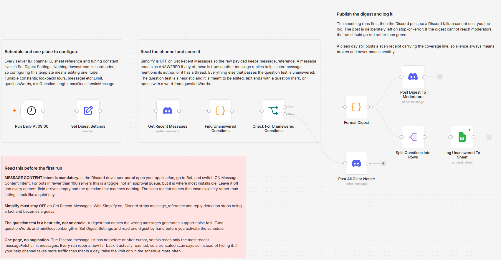

# Post a daily digest of unanswered Discord help questions to Google Sheets

[Published n8n template](https://n8n.io/workflows/17613-log-daily-unanswered-discord-help-questions-from-discord-to-google-sheets/)

Read one Discord help channel every morning, find the questions nobody answered, and post them with jump links to a moderator channel while logging each one to a Google Sheet. A message counts as answered if any of three things is true: something replied to it, a later message mentioned the asker, or it has a thread. Every run also reports how far back it actually reached, so a scan that saw less than a full day says so instead of reading like a quiet morning.

Built with n8n, plus Discord and Google Sheets.

## Use it when

- Your help channel is a support queue nobody measures, and the only sign a question was missed is somebody leaving.
- Questions get answered in bursts when a moderator happens to be around, and the ones asked at 2am quietly scroll away.
- You want a record of response coverage over time, not just a feeling that the channel is mostly fine.

## How it works

A schedule fires and one Set node supplies every ID and tuning constant. The Discord node reads the channel with Simplify off, which is what keeps the raw `message_reference` field alive so reply detection is a fact rather than a guess. A Code node keeps messages inside the lookback window that look like questions, drops anything with a reply, a later mention of the asker or a thread, and measures its own coverage while it does. If anything survives, a digest is built with a jump link per question, logged to the sheet first, then posted. If nothing survives, a scan receipt is posted instead.

| Stage | What happens |
|---|---|
| Run Daily At 09:00 | Fires once a day |
| Set Digest Settings | Every ID, sheet reference and tuning constant in one node |
| Get Recent Messages | Reads the help channel with Simplify off |
| Find Unanswered Questions | Scores each message and measures coverage |
| Check For Unanswered Questions | Splits the digest path from the all-clear path |
| Format Digest | Builds the message with a jump link per question |
| Split Questions Into Rows | One item per question for the sheet |
| Log Unanswered To Sheet | Appends the row-level detail |
| Post Digest To Moderators | Posts the digest, deliberately on stop-on-error |
| Post All Clear Notice | Posts the scan receipt on a clean day |

The sheet is written before the Discord post, which lets the post stay on stop-on-error without risking the log. If the digest cannot reach moderators, the run should go red rather than finish green with nobody told.

## Requirements

- A Discord server where you can add a bot with View Channels and Read Message History on the help channel, and Send Messages on the moderator channel.
- The MESSAGE CONTENT privileged intent switched on. The question test reads message text.
- A Google account with a spreadsheet for the log.
- n8n (cloud or self-hosted) with Discord Bot API and Google Sheets credentials.

## Setup

1. Import `workflow.json` into n8n. It imports inactive; configure before activating.
2. Create a Discord application, add a bot, and invite it with View Channels and Read Message History on the help channel plus Send Messages on the moderator channel.
3. In the Discord developer portal, Bot tab, switch on MESSAGE CONTENT INTENT. Leave it off and every content field arrives empty.
4. Paste the token into a Discord Bot API credential and assign it to all three Discord nodes, then connect Google Sheets on the log node.
5. Fill `Set Digest Settings`: guild ID, help channel ID, moderator channel ID and log sheet URL.
6. Create the log tab with the headers `Digest Date`, `Asked At`, `Age Hours`, `Author`, `Question`, `Jump Link`, `Message ID`.
7. Run it once by hand, read the digest and the coverage line, tune the question test, then activate.

## Coverage, and why the receipt exists

The Discord message list has no before, after or around parameter. You give it a channel and a limit, nothing else. So a "last 24 hours" filter can only ever be applied client side to whatever the limit returned, and on a busy channel the oldest messages in the window fall off the end unseen. Those are exactly the ones most likely to still be unanswered.

Rather than hide that, every run reports it:

| Signal | What it tells you |
|---|---|
| `oldestScannedAt` | The timestamp of the oldest message this run actually read |
| `truncated` | True when the read hit the limit while still inside the window |
| `contentBlind` | True when messages came back but every content field was empty, which means the MESSAGE CONTENT intent is off |

A truncated run prints a warning inside the digest itself. A clean day still posts a receipt carrying the coverage line, so silence from this workflow always means broken and never means healthy.

## Customize

- **The question test.** `questionWords` and `minQuestionLength` decide what counts as a question. It is a heuristic and it is meant to be edited for your channel's voice.
- **Window and reach.** `lookbackHours` sets the window; `messageFetchLimit` sets how far back one run can see. Keep the limit comfortably above your channel's daily traffic.
- **Digest length.** `maxQuestionsInMessage` trims the Discord post without trimming the sheet.
- **Cadence.** Running twice a day halves how much traffic has to fit inside the fetch limit.

## What is in this folder

| File | What it is |
|---|---|
| `README.md` | This overview |
| `TEMPLATE-DESCRIPTION.md` | The n8n Creator hub listing text |
| `workflow.json` | The importable n8n workflow |
| `images/workflow.png` | The workflow on the n8n canvas |

---

All sample data is fictional. No real credentials, IDs, or endpoints are included.

Part of the [n8n-exekyute-templates](../../README.md) collection. MIT licensed.
