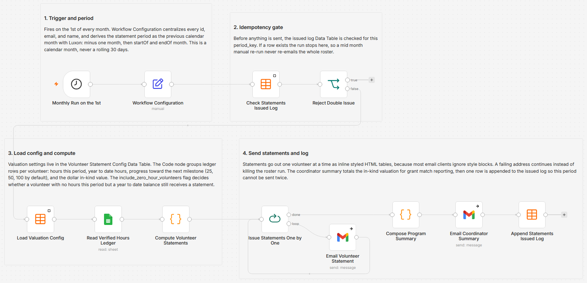

# Issue monthly volunteer hour statements from a Google Sheets ledger with Gmail

[Published n8n template](https://n8n.io/workflows/17986-send-monthly-volunteer-hour-statements-from-google-sheets-with-gmail/)

On the 1st of each month this reads a verified volunteer hours ledger in Google Sheets, emails every volunteer their own statement for the previous calendar month, and sends the coordinator one program summary carrying the total in-kind dollar value for grant match reporting. The period is the previous calendar month derived from the run date rather than a rolling 30 days, and a log row per period in a Data Table stops a re-run from emailing the whole roster twice. The hourly rate, the milestone thresholds (25, 50, 100 by default), and the zero-hour policy all live in a Data Table, so no valuation number is hardcoded in the workflow.

Built with n8n, plus Google Sheets, Gmail, and n8n Data Tables.

## Use it when

- Grant reporting season arrives and the funder wants the volunteer match in dollars. The coordinator summary totals verified hours at your configured rate and names every volunteer behind the number.
- A volunteer asks how many hours they have logged and somebody rebuilds the answer by hand from the sheet. This sends them dated line items, a period total, and a year-to-date total without anyone opening the spreadsheet.
- You re-run the workflow mid-month to fix a typo in the wording. The gate finds a log row for that period and ends the run before a single statement goes out.

## How it works

A monthly schedule fires and a Set node holds the sheet id, tab name, coordinator address, and org name while deriving the period as the previous calendar month with Luxon. Before anything is sent, a Data Table lookup on the period key runs and an IF node ends the run when a row already exists. Otherwise the valuation config loads, the ledger tab is read in full, and a Code node groups rows per volunteer into period hours, year-to-date hours, milestone progress, and in-kind value, then builds each statement as inline styled HTML. A loop sends one Gmail per volunteer and returns for the next one, so a failing address does not take the roster down with it. When the loop drains, a second Code node totals the period, the coordinator gets the summary, and one row is appended to the issued log.

| Stage | What happens |
|---|---|
| Monthly Run on the 1st | Fires at hour 6 on the 1st of each month |
| Workflow Configuration | Holds the ledger sheet id, tab name, coordinator address, and org name, and derives the period key, start, end, and label as the previous calendar month |
| Check Statements Issued Log | Reads the Volunteer Statements Issued Log Data Table for a row matching this period key |
| Reject Double Issue | Ends the run when that row exists, otherwise carries on |
| Load Valuation Config | Reads the Volunteer Statement Config Data Table for the hourly rate, the milestone thresholds, and the zero-hour flag |
| Read Verified Hours Ledger | Pulls every row of the ledger tab |
| Compute Volunteer Statements | Groups rows by lowercased email, computes period and year-to-date hours, milestone progress, and in-kind value, and writes the statement HTML |
| Issue Statements One by One | Loops the roster one volunteer per iteration, then hands the drained loop to the summary |
| Email Volunteer Statement | Sends one statement with the org name as the display name; a failed send continues instead of ending the run |
| Compose Program Summary | Totals period hours and in-kind value, ranks volunteers by hours, and lists milestones crossed this period |
| Email Coordinator Summary | Sends that summary to the coordinator address |
| Append Statements Issued Log | Writes one row for the period with the counts, the totals, and the issued timestamp |

I put the rate and the thresholds in a Data Table rather than in the Code node because the in-kind rate is jurisdiction and year specific, and a coordinator should be able to change it without opening a workflow.

## Requirements

- A Google account with the hours ledger. Read access is enough, since the workflow only reads the ledger tab and never writes back to it.
- A ledger tab already holding approved entries only, with one consistent email address per volunteer. No status or verified column is read, and rows group on the lowercased email.
- A Gmail account to send from. It is the from address with no send-as alias; only the display name on the volunteer email is overridden, using the org name.
- Two Data Tables in the same n8n project, referenced by name. Keep a single Volunteer Statement Config row, because the code takes the first row carrying a `milestone_thresholds` value and ignores the rest.
- An in-kind hourly rate your funder will accept. A missing or non-numeric rate falls back to zero and statements still go out showing $0.00.
- n8n (cloud or self-hosted) with Google Sheets and Gmail credentials.

## Setup

1. Import `workflow.json` into n8n. It imports inactive; configure before activating.
2. Create the two Data Tables in the same project. Volunteer Statement Config takes `in_kind_hourly_rate`, `milestone_thresholds`, `include_zero_hour_volunteers`, and `rate_note`, with exactly one row. Volunteer Statements Issued Log takes `period_key`, `period_start`, `period_end`, `volunteers_emailed`, `total_period_hours`, `total_in_kind_value`, and `issued_at`.
3. Replace the four placeholders in "Workflow Configuration" with your spreadsheet id, tab name, coordinator address, and org name. Assign Google Sheets credentials to "Read Verified Hours Ledger" and Gmail credentials to both Gmail nodes.
4. Run it once by hand with your own address in the ledger, read the statement and the summary that arrive, then activate.

## The ledger tab

| Column | What it holds |
|---|---|
| `date` | An ISO date. Dates are compared as text after being cut to ten characters, so `8/1/2026` falls outside the range test and gets skipped |
| `volunteer name` | The display name. `volunteer_name` and `name` are accepted too |
| `email` | The grouping key, lowercased before grouping |
| `hours` | A number above zero. Anything else drops the row |
| `activity` | The line item label, defaulting to "Volunteer service" when blank |

## The issued-log gate

The gate is per period, not per volunteer, and the log row is appended last. A run that dies partway through the roster records nothing, so the retry emails everyone again, including the volunteers who already have their statement. A run where every send failed still logs the period as issued, because the append sits downstream of the coordinator email rather than of a success count. Read the execution before you retry.

## Customize

- Change the hour and the day in "Monthly Run on the 1st". It fires at hour 6 with no day set, which lands on the 1st.
- Set `milestone_thresholds` as a comma-separated list. Thresholds are tested against year-to-date hours rather than period hours, and default to 25, 50, 100 when the value is missing.
- Set `include_zero_hour_volunteers` to send a statement to volunteers with a year-to-date balance but no hours this period. Boolean true and the string "true" both work.
- Edit the statement wording in "Compute Volunteer Statements". The HTML has to stay inline styled: there is no style block, and most email clients strip one.
- Change the `yearStart` line in that same node for fiscal-year reporting. It is currently January 1 of the period's year.
- Edit the coordinator email content in "Compose Program Summary", where the totals, the ranked roster, and the milestone list are assembled.

## What is in this folder

| File | What it is |
|---|---|
| `README.md` | This overview |
| `TEMPLATE-DESCRIPTION.md` | The n8n Creator hub listing text |
| `workflow.json` | The importable n8n workflow |
| `images/workflow.png` | The workflow on the n8n canvas |

---

All sample data is fictional. No real credentials, IDs, or endpoints are included.

Part of the [n8n-exekyute-templates](../../README.md) collection. MIT licensed.
