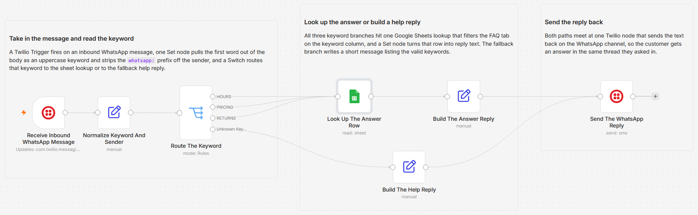

# Answer WhatsApp keyword questions from a Google Sheet FAQ

[Published n8n template](https://n8n.io/workflows/17341-answer-whatsapp-keyword-faqs-with-twilio-and-google-sheets/)

Reply to keyword questions on a WhatsApp number with canned answers pulled from a Google Sheet: a customer sends HOURS, the workflow finds that row in the FAQ tab, and Twilio sends the answer back. Every reply is the exact sentence sitting in a spreadsheet cell, so the same keyword always returns the same answer and staff change the wording without opening n8n.

Built with n8n, plus Twilio and Google Sheets.

## Use it when

- The same few questions arrive on the business WhatsApp number every day: opening hours, pricing, returns. This answers each one instantly and identically.
- A customer asks about pricing at 11 pm and nobody is watching the phone. The reply goes out in seconds, worded exactly as it sits in the sheet.
- Someone sends a word the number does not answer. The fallback replies with the three keywords it does handle, so the message does not sit unread until morning.

## How it works

A Twilio Trigger fires when an inbound WhatsApp message hits the sandbox number. A Set node takes the first word of the message body, strips punctuation, uppercases it, and pulls the sender's number off the payload. A Switch matches that token against HOURS, PRICING, and RETURNS. All three matches go to a single Google Sheets lookup that filters the FAQ tab on the keyword column, and a Set node turns the matched row into reply text. Anything the Switch does not recognise falls to the fallback output, which builds a short help message instead. Both paths meet at the Twilio node, which sends the text back on the WhatsApp channel.

| Stage | What happens |
|---|---|
| Receive Inbound WhatsApp Message | Twilio Trigger fires on an inbound WhatsApp message to the sandbox number |
| Normalize Keyword And Sender | Takes the first word of the body as an uppercase keyword and strips the `whatsapp:` prefix off the sender |
| Route The Keyword | Switch with a rule per keyword (HOURS, PRICING, RETURNS) and a fallback output for everything else |
| Look Up The Answer Row | Reads the FAQ tab and returns the first row whose `keyword` column matches |
| Build The Answer Reply | Builds the reply text from the sheet row and carries the sender's number forward |
| Build The Help Reply | On the fallback branch, builds a short message listing the valid keywords |
| Send The WhatsApp Reply | Twilio sends the reply with `toWhatsapp` on, inside the 24 hour window the inbound message opened |

I keep the answers in the Sheet, not in the nodes, because the person who owns the wording usually should not need access to the workflow.

## Requirements

- A Twilio account with WhatsApp enabled, or the WhatsApp Sandbox. A free trial is enough; see the testing section below.
- A Google Sheet with a `FAQ` tab holding `keyword` and `answer` columns.
- n8n (cloud or self-hosted) with Twilio and Google Sheets credentials.

## Setup

1. Import `workflow.json` into n8n. It imports inactive; configure before activating.
2. Add a Twilio credential (Account SID and Auth Token) and assign it to "Receive Inbound WhatsApp Message" and "Send The WhatsApp Reply". Add a Google Sheets credential and assign it to "Look Up The Answer Row".
3. Open "Look Up The Answer Row" and pick your spreadsheet and the `FAQ` tab. Open "Send The WhatsApp Reply" and set `From` to your Twilio WhatsApp sandbox number.
4. In the Twilio Console, paste the production URL from the trigger node into the WhatsApp Sandbox "When a message comes in" field with method POST. Send yourself a test message, check the execution, then activate.

## Testing on a Twilio trial

This one is fully testable on a trial with real custom text, which is unusual: trial accounts cannot send custom SMS or WhatsApp bodies, but the WhatsApp Sandbox is exempt inside the 24 hour window.

| Step | What to do |
|---|---|
| 1 | In the Twilio Console open Messaging, then Try it out, then Send a WhatsApp message, and enable the sandbox |
| 2 | From your own phone, send the join code to the sandbox number. That opens the 24 hour window |
| 3 | Seed the FAQ tab with three rows: HOURS, PRICING, RETURNS, each with an answer |
| 4 | Send each keyword and confirm the canned answer comes back |
| 5 | Send something nonsense and confirm the help reply lists the three valid keywords |

Inbound receiving is unrestricted on a trial, and a sandbox session lasts three days before you have to send the join code again. Trial accounts also only send to verified numbers, so test from the phone you signed up with. Outside the 24 hour window WhatsApp allows only an approved template, so this answers inbound messages and never starts a conversation.

## Customize

- Add a keyword: one new row in the FAQ tab plus one new rule in "Route The Keyword".
- Change any answer by editing its cell in the Sheet. The workflow picks it up on the next message.
- Reword the fallback in "Build The Help Reply", for example to hand off to a human instead of listing keywords.
- Go open-ended: drop the Switch and let every message hit the Sheet filter directly.
- Match more than the first word: the token logic lives in "Normalize Keyword And Sender".

## What is in this folder

| File | What it is |
|---|---|
| `README.md` | This overview |
| `TEMPLATE-DESCRIPTION.md` | The n8n Creator hub listing text |
| `workflow.json` | The importable n8n workflow |
| `images/workflow.png` | The workflow on the n8n canvas |

---

All sample data is fictional. No real credentials, IDs, or endpoints are included.

Part of the [n8n-exekyute-templates](../../README.md) collection. MIT licensed.
