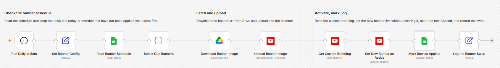

# Rotate YouTube channel banners on a schedule using Google Sheets and Drive

[Published n8n template](https://n8n.io/workflows/17137-rotate-youtube-channel-banners-on-a-schedule-with-google-sheets-and-drive/)

Swap your YouTube channel banner on the dates planned in a Google Sheet, pulling each day's artwork from Google
Drive and marking the row Applied once the banner is live. The due check is plain date arithmetic: rows due today
or overdue and not yet Applied run oldest first, so a missed day catches up and the newest due banner ends up live.

Built with n8n, plus YouTube, Google Sheets, and Google Drive.

## Use it when

- You rotate banner art for seasons, launches, or campaigns. Plan the dates once and the swap happens on its own.
- A campaign banner has to be live on launch day, not whenever someone remembers to upload it.
- Your instance was down on swap day. The next run still applies the missed banner, and the newest one wins.

## How it works

Every morning the trigger fires, a Set node supplies the channel ID, and Google Sheets reads the full schedule.
A Code node keeps the rows due today or overdue that are not yet marked Applied, oldest first; a day with
nothing due ends there. Each due row's artwork comes down from Drive as binary data, goes up through the
YouTube Channel: uploadBanner operation, and goes live through Channel: update. Then the row is marked Applied.

| Stage | What happens |
|---|---|
| Run Daily at 8am | Fires the workflow every morning |
| Set Banner Config | Holds your `channelId` in one editable place |
| Read Banner Schedule | Pulls every row of the schedule sheet |
| Select Due Banners | Keeps rows due today or overdue and not yet Applied, oldest first |
| Download Banner Image | Fetches the banner file from Google Drive as binary data |
| Upload Banner Image | Runs Channel: uploadBanner, which returns the new banner URL |
| Get Current Branding | Reads the channel's live description, keywords, country, and trailer |
| Set New Banner as Active | Runs Channel: update with the new banner plus the existing branding |
| Mark Row as Applied | Writes `Applied` to the row's Status column so it never repeats |
| Log the Banner Swap | Records the time, channel, label, date, file ID, and banner URL |

I read the current branding right before the update because the YouTube API clears any branding field the
call leaves out; re-sending your description, keywords, country, and trailer keeps the channel untouched.

## Requirements

- A YouTube channel you manage, reached through a YouTube (Google) OAuth2 credential.
- A Google Sheet holding the schedule, and the banner images stored in Google Drive.
- n8n (cloud or self-hosted) with YouTube, Google Sheets, and Google Drive credentials.

## Setup

1. Import `workflow.json` into n8n. It imports inactive; configure before activating.
2. Add a YouTube (Google) OAuth2 credential and assign it to the three YouTube nodes: "Upload Banner Image",
   "Get Current Branding", and "Set New Banner as Active". Add Google Sheets and Google Drive credentials to
   the remaining nodes.
3. Open "Set Banner Config" and set `channelId` to your YouTube channel ID.
4. Point both Google Sheets nodes at your schedule spreadsheet and tab.
5. Prepare banner art at 2048x1152 px and under 6 MB, upload it to Drive, and add one row per swap to the sheet.
6. Run it once by hand, confirm the banner and the sheet, then activate.

## The schedule sheet

One row per planned swap, plus a Status column the workflow maintains:

| Column | Example | Notes |
|---|---|---|
| `Swap Date` | `2026-07-15` | The date the banner goes live. Plain `yyyy-MM-dd` text or a real date cell both work. |
| `Banner Drive File ID` | `1AbCdEfGhIjKlMnOp` | The Google Drive file ID of the banner image. |
| `Label` | `Summer banner` | Optional. Recorded with the swap for reference. |
| `Status` | | Leave empty. The workflow writes `Applied` once the banner is live, so a row never runs twice. |

## Customize

- **Run time.** Change the hour in "Run Daily at 8am". The due check compares dates, not times.
- **Due-date rules.** "Select Due Banners" holds the catch-up logic; tighten it there if overdue rows should be skipped.
- **More channels.** Extend "Set Banner Config" if you manage more than one channel.
- **The swap log.** "Log the Banner Swap" ends the run holding the full swap record; append a Sheets or Slack node to push it somewhere visible.

## What is in this folder

| File | What it is |
|---|---|
| `README.md` | This overview |
| `TEMPLATE-DESCRIPTION.md` | The n8n Creator hub listing text |
| `workflow.json` | The importable n8n workflow |
| `images/workflow.png` | The workflow on the n8n canvas |

---

All sample data is fictional. No real credentials, IDs, or endpoints are included.

Part of the [n8n-exekyute-templates](../../README.md) collection. MIT licensed.
