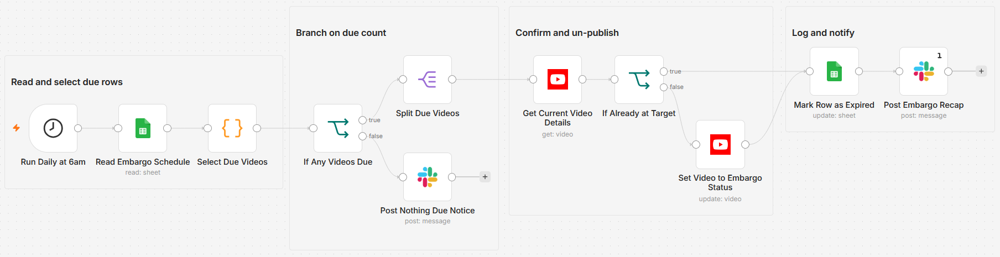

# Auto un-publish expired YouTube videos on a schedule

[Published n8n template](https://n8n.io/workflows/17091-unpublish-expired-youtube-videos-using-google-sheets-and-slack/)

Read a Google Sheets embargo list once a day, set every video whose date has passed to
`private` or `unlisted`, mark the row `Expired`, and post a Slack recap. A row is due
when its `Unpublish Date` is on or before today in a timezone you set and its `Status`
is not yet `Expired`, so re-runs never touch a processed row. The update carries the
existing title and category through, because YouTube rejects a status change without them.

Built with n8n, plus YouTube, Google Sheets, and Slack.

## Use it when

- A contest video or event promo has to come down on a set date, and that date lands on
  a weekend when nobody is watching the channel.
- Licensed footage or an embargoed announcement carries a hard expiry, and leaving it
  public past the date is a contract problem, not just an oversight.
- Seasonal clips pile up every year and un-publishing them is a manual checklist. One
  control sheet replaces the reminders.

## How it works

Once a day the workflow reads the control sheet and runs every row through the due
rule. A quiet day ends with a one-line Slack notice. When videos are due, the list fans
out to one item per video: YouTube returns the current details, anything already at its
target status skips the write, the rest get their privacy flipped, and every processed
row is marked `Expired` with a timestamp.

| Stage | What happens |
|---|---|
| Run Daily at 6am | Fires once a day; the hour is yours to change |
| Read Embargo Schedule | Pulls every row from the control sheet |
| Select Due Videos | Applies the due rule at day level in the `TIMEZONE` you set, and defaults a blank target to `private` |
| If Any Videos Due | Routes to the un-publish path, or to "Post Nothing Due Notice" when nothing is due |
| Split Due Videos | Fans the due list out to one item per video |
| Get Current Video Details | Fetches each video's snippet and status from YouTube |
| If Already at Target | Skips the update when the video already sits at its target status, so no needless API writes |
| Set Video to Embargo Status | Sets privacy to `private` or `unlisted`, passing the existing title and category through |
| Mark Row as Expired | Writes `Expired` and an `Unpublished At` timestamp back to the row, matched on `videoId` |
| Post Embargo Recap | Posts one Slack message listing each video and its new status |

I compare dates at day level with an explicit `TIMEZONE` constant because a video set
to expire on the first should flip on the first where you are, not where the server is.

## Requirements

- A YouTube (Google) account with OAuth2 access to the channel that owns the videos.
- A Google account with a spreadsheet for the control sheet.
- A Slack workspace with a channel for the recap.
- n8n (cloud or self-hosted) with YouTube, Google Sheets, and Slack credentials.

## Setup

1. Import `workflow.json` into n8n. It imports inactive; configure before activating.
2. Connect a YouTube (Google) OAuth2 credential on "Get Current Video Details" and
   "Set Video to Embargo Status".
3. Create the control sheet with the columns below, connect a Google Sheets credential
   on "Read Embargo Schedule" and "Mark Row as Expired", and point both at it.
4. Connect a Slack credential and pick the recap channel on "Post Embargo Recap" and
   "Post Nothing Due Notice".
5. Open "Select Due Videos" and set `TIMEZONE` to your channel's timezone (an IANA name such as `America/Halifax`).
6. Run it once by hand, confirm the recap, then activate.

## The control sheet

| Column | What goes in it |
|---|---|
| `videoId` | The YouTube video ID; the workflow matches rows on it |
| `Unpublish Date` | A date such as `2026-08-01` |
| `Target Status` | `private` or `unlisted`; optional, a blank cell defaults to `private` |
| `Status` | Leave blank; the workflow writes `Expired` here |
| `Unpublished At` | Optional; the workflow writes a timestamp here |

## Customize

- **Cadence.** The trigger fires daily at 6am. Run it more often in "Run Daily at 6am"
  if a date change needs to take effect the same day.
- **Default target.** Change `DEFAULT_TARGET` from `private` to `unlisted` in "Select Due Videos".
- **Recap detail.** Add columns such as a reason or an owner to the sheet and pull them
  into the message in "Post Embargo Recap".
- **Notification channel.** Swap the two Slack nodes for email or another channel.

## What is in this folder

| File | What it is |
|---|---|
| `README.md` | This overview |
| `TEMPLATE-DESCRIPTION.md` | The n8n Creator hub listing text |
| `workflow.json` | The importable n8n workflow |
| `images/workflow.png` | The workflow on the n8n canvas |

---

All sample data is fictional. No real credentials, IDs, or endpoints are included.

Part of the [n8n-exekyute-templates](../../README.md) collection. MIT licensed.
